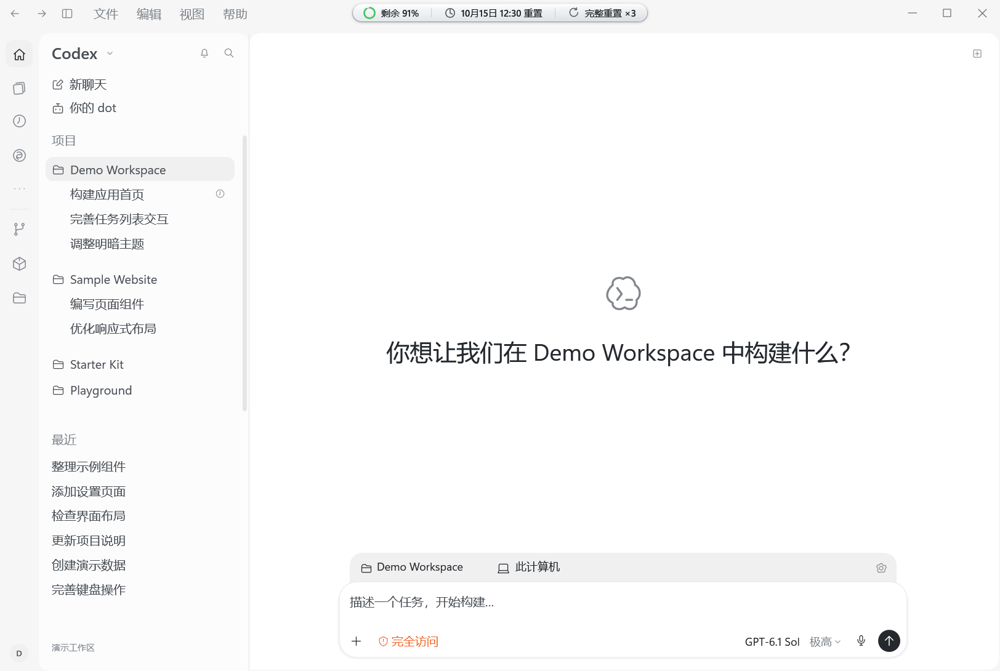
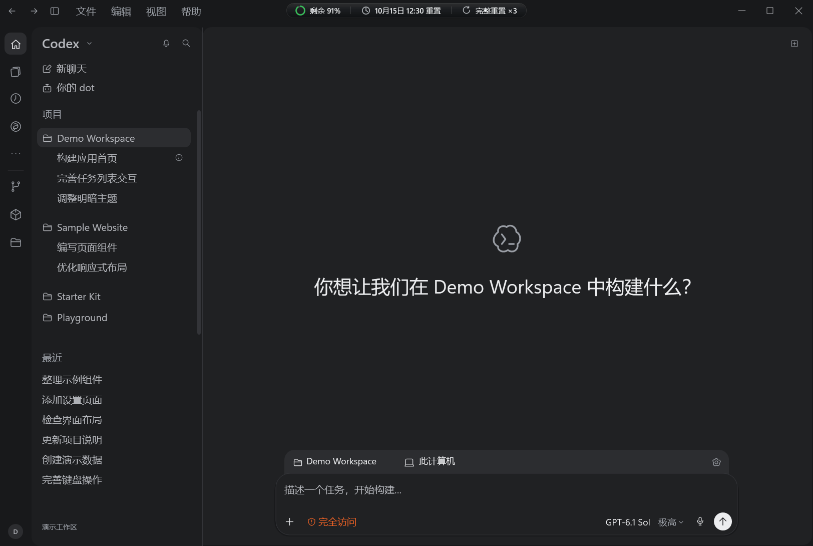
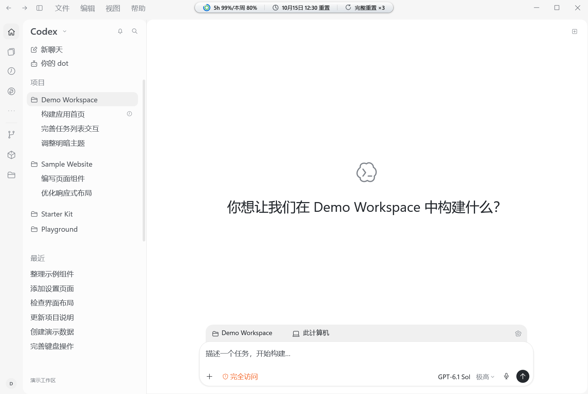
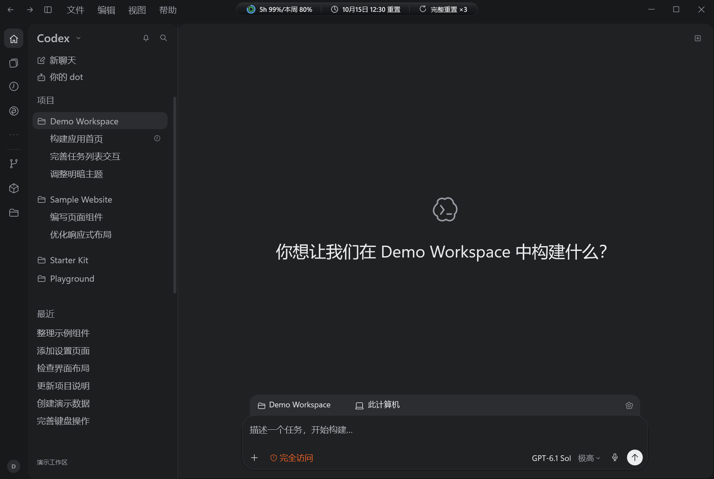
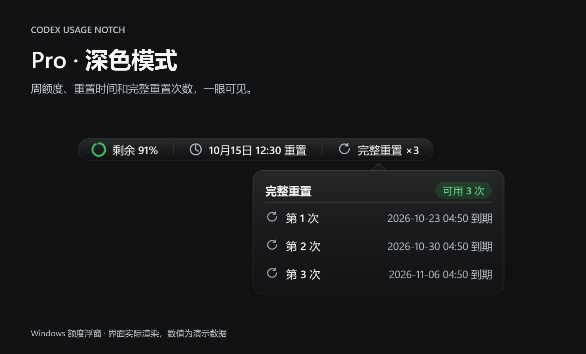
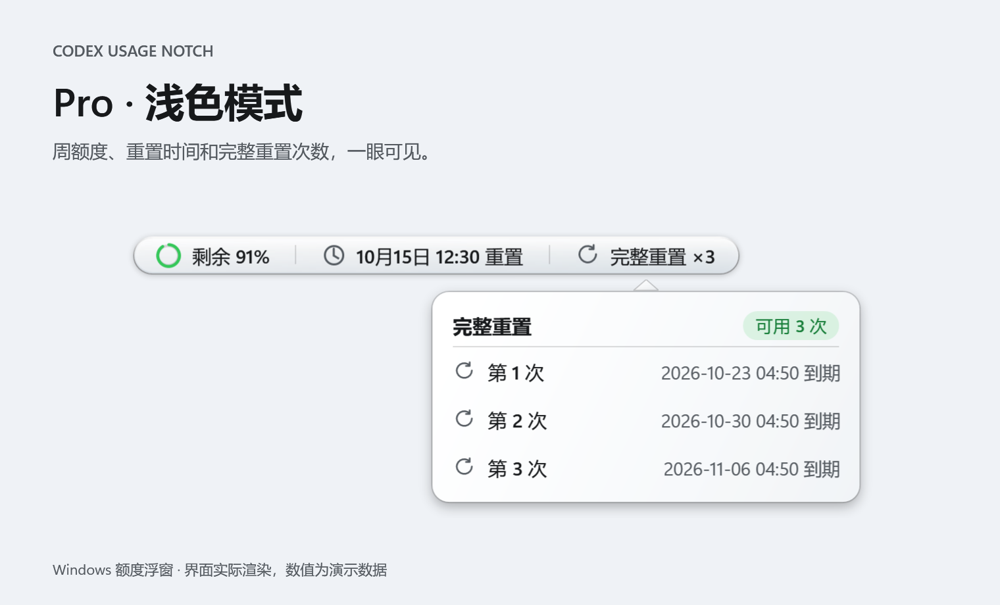
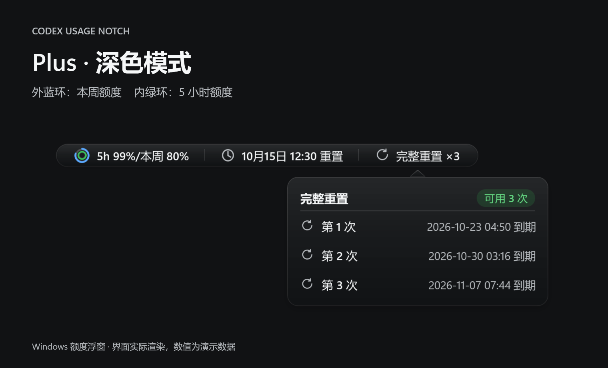
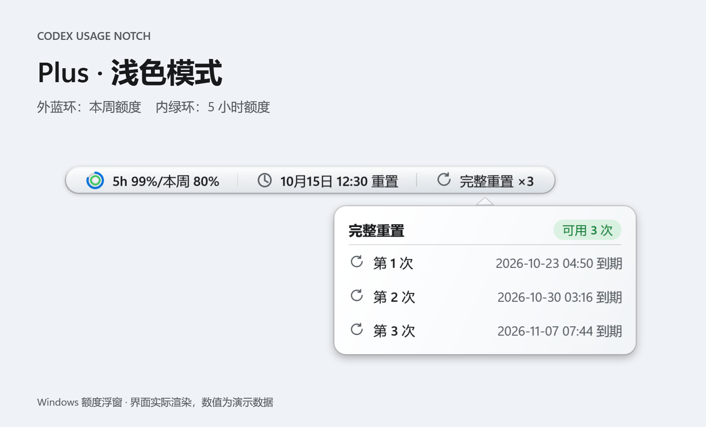

# CodexUsageNotch · Codex 额度浮窗

一个适用于 Windows 的 Codex 桌面伴随工具。把剩余额度、重置时间和完整重置次数放进标题栏中的小胶囊，工作时抬眼就能看到。

支持 Pro 的单额度显示，以及 Plus 的「5 小时 + 本周」双额度显示；自动适配明暗主题、窗口大小和系统 DPI。

**[下载单文件 EXE](https://github.com/Lzy-shulab/CodexUsageNotch/releases/latest/download/CodexUsageNotch.exe)** · **[下载完整便携包](https://github.com/Lzy-shulab/CodexUsageNotch/releases/latest/download/CodexUsageNotch-1.1.2-win-x64.zip)** · [查看发布说明](https://github.com/Lzy-shulab/CodexUsageNotch/releases/latest)

## 完整窗口展示

以下为模拟的 Codex 完整窗口。项目名称、聊天记录、头像及输入区均为虚构内容；顶部额度胶囊由本程序实际渲染，额度和时间为演示数据。

### Pro · 浅色



<details>
<summary>查看 Pro 深色、Plus 浅色和 Plus 深色完整窗口</summary>

### Pro · 深色



### Plus · 浅色



### Plus · 深色



</details>

## 额度浮窗细节

| Pro · 深色 | Pro · 浅色 |
| :---: | :---: |
|  |  |

| Plus · 深色 | Plus · 浅色 |
| :---: | :---: |
|  |  |

以上为程序实际渲染的界面，数值为演示数据。图中展开的是右侧「完整重置」的到期列表。

## 功能与操作

- **Pro 单额度**：保留绿色圆环和剩余百分比的紧凑布局。
- **Plus 双额度**：蓝色外环表示本周剩余，绿色内环表示 5 小时剩余；文字显示为 `5h 99%/本周 80%`。
- **点击左侧额度**：查看各周期的剩余比例和重置时间。
- **中间重置时间**：纯展示，点击无操作；双额度时显示周额度重置时间。
- **点击右侧完整重置**：查看可用次数及各次到期时间。
- **右键浮窗**：立即刷新或退出。

正式版首次运行后自动设置当前用户的开机启动。登录 Windows 后程序在后台等待，打开或切回 Codex 时显示浮窗，关闭 Codex 或切换到其他应用时隐藏，不占任务栏位置。Pro 和 Plus 使用相同的高度、字号和缩放规则，窄窗口自动压缩文案。

程序每 10 秒通过本机 Codex app-server 只读获取额度，不发送模型请求，也不执行完整重置。单、双额度布局按实际返回的额度窗口识别，无需手动选择会员类型。这是独立伴随程序。

## 使用

1. 在 Windows x64 电脑上安装 Codex 桌面客户端并登录账号。
2. 将 `CodexUsageNotch.exe` 放在固定位置，双击运行一次，即自动设置开机启动。EXE 内置 .NET 运行环境。
3. 以后登录 Windows 无需手动启动，打开 Codex 即可看到浮窗；更新版本前，从旧浮窗的右键菜单退出。

便携 ZIP 额外包含四张效果图、使用说明，以及 `Preview-Pro-Dark.cmd`、`Preview-Pro-Light.cmd`、`Preview-Plus-Dark.cmd`、`Preview-Plus-Light.cmd` 四个演示入口。演示使用模拟数据，可以与正常浮窗同时运行；切换演示前，先右键退出已打开的演示。

也可以从命令行预览：

```powershell
# Pro 深色预览
.\CodexUsageNotch.exe --preview --demo --theme=dark

# Plus 浅色预览
.\CodexUsageNotch.exe --preview --demo=plus --theme=light
```

添加 `--popover` 可在预览启动时展开完整重置详情。

## 项目结构

| 目录 | 内容 |
| --- | --- |
| `CodexUsageNotch` | WPF 主程序、额度解析、主题与窗口跟随 |
| `CodexUsageNotch.Tests` | 功能自检、界面检查和展示图导出 |
| `scripts` | 构建、安装、卸载 |
| `docs/images` | Pro / Plus 的完整模拟窗口与浮窗明暗效果图 |

在 Windows 上重新生成展示图：

```powershell
dotnet run --project CodexUsageNotch.Tests -c Release -- --gallery
```

完整窗口由 `CodexUsageNotch.Tests/DesktopShowcase.cs` 中的固定演示内容绘制，无需读取个人项目或聊天记录。
